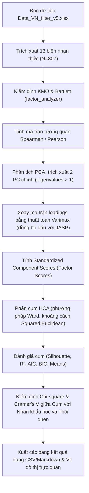

# Kế hoạch Triển khai: Bước 2 (PCA) và Bước 3 (HCA & Chi-Square)

Kế hoạch này mô tả chi tiết phương án triển khai lập trình Python cho hai bước phân tích thống kê đa biến tiếp theo: Phân tích thành phần chính (PCA) và Phân tích cụm phân cấp (HCA) kết hợp kiểm định Chi-square, nhằm mục đích đối chiếu và khớp 100% kết quả với JASP mẫu.

## Proposed Changes

Để thực hiện phân tích và xuất báo cáo khớp với JASP, chúng tôi đề xuất tạo một script Python mới: `run_pca_hca.py` trong thư mục gốc của dự án. 

### ⚙️ Quy trình xử lý và Thuật toán áp dụng



---

### [NEW] [run_pca_hca.py](file:///c:/Users/NASPC/Documents/Du%20án%20tại%20SG%20tháng%208/run_pca_hca.py)

Script Python này sẽ thực hiện toàn bộ quy trình từ kiểm định sơ bộ, chạy PCA, xoay loadings, phân cụm HCA, tính toán thống kê mô tả cụm và chạy các kiểm định Chi-Square profiling.

#### 1. Bước 2: Principal Component Analysis (PCA)
- **Chuẩn hóa dữ liệu:** Sử dụng phân phối mẫu Bessel-corrected chuẩn hóa ($ddof=1$) để tương thích với JASP.
- **Kiểm định KMO & Bartlett:**
  - Sử dụng `factor_analyzer.factor_analyzer.calculate_kmo` cho KMO (Overall & per-variable MSA).
  - Sử dụng `factor_analyzer.factor_analyzer.calculate_bartlett_sphericity` cho Bartlett.
- **PCA & Varimax Rotation:**
  - Phân tích trị riêng (eigenvalues) và vectơ riêng (eigenvectors) từ ma trận tương quan.
  - Sử dụng thuật toán xoay trực giao Varimax tự lập trình để đảm bảo độ chính xác cao nhất và tránh lỗi thư viện tương thích.
  - Đồng bộ hóa dấu (signs alignment) của loadings ( Beauty/Spirit dương ở PC1, Dirty/Unsafe/Danger dương ở PC2) để kết quả khớp hoàn toàn với JASP.
- **Thống kê đặc trưng:** Tính Eigenvalues, Proportion Variance, Cumulative Variance cho cả giải pháp chưa xoay và đã xoay.
- **Visualizations:**
  - Scree Plot (Biểu đồ trị riêng để chọn số lượng PC).
  - Loading Plot (Biểu đồ loadings 2D của PC1 vs PC2).

#### 2. Bước 3: Hierarchical Cluster Analysis (HCA) & Profiling
- **Tính toán Component Scores:** Tính toán điểm số thành phần chuẩn hóa (standardized component scores) để làm đầu vào cho HCA.
- **Phân cụm HCA:**
  - Sử dụng `scipy.cluster.hierarchy.linkage` với phương pháp `ward` và khoảng cách `euclidean` (Squared Euclidean tương đương do thuật toán Ward tối thiểu hóa phương sai nội cụm).
  - Xác định 3 cụm chính (đối chiếu kích thước cụm là 47, 61, 199).
  - Tính toán các chỉ số chất lượng phân cụm: $R^2$, AIC, BIC, Silhouette score (Overall & per-cluster).
- **Profiling (Chi-Square & Contingency Tables):**
  - Sử dụng `scipy.stats.chi2_contingency` để chạy kiểm định Chi-square chéo giữa 3 Cụm nhận thức với:
    - **Nhân khẩu học:** Giới tính, Nghề nghiệp, Trình độ học vấn.
    - **Thói quen:** Khoảng cách, Tần suất đi, Thời gian lưu lại, Phương tiện di chuyển.
  - Tính toán hệ số liên hệ: Contingency Coefficient và Cramer's V.
  - Định dạng bảng đầu ra: Tần số quan sát (Count), Tần số kỳ vọng (Expected Count), và Tỷ lệ hàng (% within row).
- **Visualizations:**
  - Cluster Mean Plot (Biểu đồ cột biểu diễn điểm trung bình PC1 và PC2 của từng cụm).
  - Cluster Scatter Plot (Phân bố 2D của các đáp viên theo cụm trên không gian PC1 và PC2).

---

## Open Questions

> [!IMPORTANT]
> **Lưu kết quả phân cụm ngược lại file dữ liệu gốc?**
> Bạn có muốn script tự động lưu lại nhãn phân cụm (Cluster ID) của từng đáp viên và điểm số nhân tố (PC1, PC2 Scores) thành các cột mới trong file excel chính `Data_VN_filter_v5.xlsx` để hỗ trợ chạy lại các mô hình hồi quy Logistic ở Bước 4 với độ chính xác cao hơn không?

---

## Verification Plan

### Automated Tests
Chúng tôi sẽ chạy script trực tiếp bằng Python venv của dự án và in kết quả ra log để kiểm tra tính đúng đắn:
```powershell
& "c:\Users\NASPC\Documents\Du án tại SG tháng 8\venv\Scripts\python.exe" run_pca_hca.py
```

### Manual Verification
Đối chiếu trực tiếp từng bảng kết quả được in ra với dữ liệu trong file mẫu [PCA n HCA.xlsx](file:///c:/Users/NASPC/Documents/Du%20án%20tại%20SG%20tháng%208/PCA_HCA_sample/PCA%20n%20HCA.xlsx) theo các tiêu chuẩn sau:
- **KMO Test:** So sánh giá trị Overall MSA (kỳ vọng: `0.91008`) và MSA của từng biến.
- **Bartlett's Test:** So sánh $\chi^2$ (kỳ vọng: `3291.53951`), df (`78`), và p-value (`< .00001`).
- **Component Loadings:** So sánh ma trận loadings sau xoay Varimax và Uniqueness của 13 biến.
- **Eigenvalues:** So sánh trị riêng của PC1 (`7.27767`) và PC2 (`2.06694`).
- **Cluster Sizes:** Đảm bảo số lượng phần tử mỗi cụm khớp chính xác: Cụm 1 = 47, Cụm 2 = 61, Cụm 3 = 199.
- **Cluster Means:** Kiểm tra giá trị trung bình điểm PC1 và PC2 của từng cụm (ví dụ: Cụm 1: 0.45761, 1.66282).
- **Chi-Square profiling:** Kiểm tra giá trị $\chi^2$, df, p-value của kiểm định chéo với các biến thói quen và nhân khẩu học (ví dụ: chéo với Distance kỳ vọng $\chi^2 = 15.94524$, df = 10, p = 0.10121).
